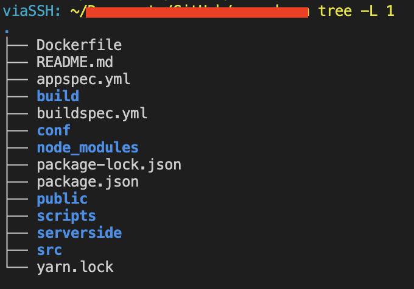

## Applictaion Load Balancer 헬스체크 로깅 안보이게하기

> EKS에서 ingress 로 alb 를 사용하고 있는데 서비스 테스트 중 백앤드에서 로그를 확인하려고하는데 health check 로그가 너무 많아 정작 중요한 로그가 잘안보여 alb 로그를 안보이게 하려고한다.

프런트 서비스에서는 nginx로 react를 돌리고있다. 이 nginx의 default.conf 파일에서 특정 로그는 무시하도록 할 수 있다.

nginx를 사용하고 있다면 일반적으로 `/etc/nginx/conf.d/default.conf` 이 경로에 config 파일이 있을 것이다. 여기에서 `ELB-HealthChecker/2.0` 라는 값만 제외해 Access log를 남길 수 있도록 설정할 수 있다.

EKS에서 이 설정 파일을 front 서비스에 배포하고 적용을 자동으로 하고싶다면 [이 포스트](https://viassh.github.io/network/github-action-ecr-cicd/#시작하기) 를 참고하여 구성할 수 있다.

```bash
# default.conf 
# ADD 추가
map $http_user_agent $ignore_useragent {
    default 1;
    "ELB-HealthChecker/2.0" 0;
}

server {
    listen 80;

    add_header 'Access-Control-Allow-Origin' '*';
    add_header 'Access-Control-Allow-Methods' 'GET, POST, OPTIONS, PUT, PATCH, DELETE' always;
    add_header 'Access-Control-Allow-Headers' 'X-Requested-With,Accept,Content-Type, Origin' always;

    location / {
        root   /usr/share/nginx/html;
        add_header 'Access-Control-Allow-Origin' '*';
        add_header 'Access-Control-Allow-Methods' 'GET, POST, OPTIONS, PUT, PATCH, DELETE' always;
        add_header 'Access-Control-Allow-Headers' 'X-Requested-With,Accept,Content-Type, Origin' always;

        index  index.html index.htm;
        try_files $uri $uri/ /index.html;

        # ADD 추가
        access_log /var/log/nginx/access.log combined if=$ignore_useragent;
    }

    error_page   500 502 503 504  /50x.html;

    location = /50x.html {
        root   /usr/share/nginx/html;
    }
}
```


Dockerfile 을 사용해 nginx를 배포하고 있다면 도움이 될까해서 Dockerfile을 첨부해본다.

```bash
FROM node:14.15.4 as builder

# 소스 폴더 생성
RUN mkdir /usr/src/app
WORKDIR /usr/src/app
ENV PATH /usr/src/app/node_modules/.bin:$PATH
COPY package.json /usr/src/app/package.json

# 패키지 설치
RUN npm install --silent
# RUN npm install react-scripts@3.4.1 -g --silent

# 작업폴더로 복사하고 빌드
COPY . /usr/src/app
RUN npm run build

FROM nginx:1.19

# nginx의 기본 설정을 삭제하고 앱 소스에서 설정한 파일을 복사
# 소스 코드에 /conf/conf.d 파일이 있어야함
RUN rm -rf /etc/nginx/conf.d
COPY conf /etc/nginx

# 위에서 생성한 앱의 빌드산출물을 nginx의 샘플 앱이 사용하던 폴더로 이동
COPY --from=builder /usr/src/app/build /usr/share/nginx/html

# 80포트 오픈하고 nginx를 백그라운드로 실행
EXPOSE 80
CMD ["nginx", "-g", "daemon off;"]
```



소스는 이런 구조로 구성되어있고 conf/conf.d/default.conf 파일이 있어야한다.

```
RUN rm -rf /etc/nginx/conf.d
COPY conf /etc/nginx
```
Dockerfile에 위 명령어가 기존 nginx conf 파일을 삭제하고 새로 생성한 conf 파일을 넣어 이미지로 만드는 것이다.