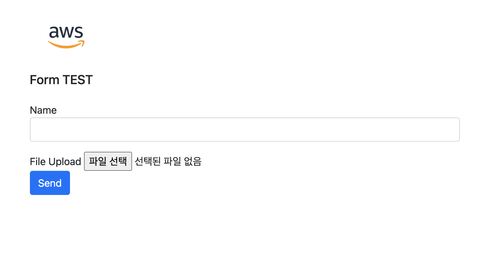

HTML Form 데이터 POST를 AWS Lambda Function URL 을 이용해서 처리해보기
=============

간단하게 웹에서 Form 양식을 만들어 S3로 파일을 업로드 해야될 상황이 생겨 테스트를 해보았다.

웹에서 파일 이름과 이미지 데이터를 입력받아 Lambda **Function URL**로 POST를 보내 데이터를 전송하였다. 

Lambda에서는 해당 요청을 받아 Body를 Decode하고 Lambda tmp 위치에 입력받은 이미지를 저장하여 S3로 업로드하는 과정이다.

\* 오류처리나 유효성 검사부분은 들어가있지 않음에 유의... 단순 테스트 용도임

> 심플한 Form HTML. multipart/form-data 로 데이터를 전송한다. form의 action 부분에 Lambda URL을 입력한다.



로컬에서 파일 생성 후 S3 정적 웹 호스팅을 이용해 올려보자.

[S3 Static Web hosting에 대해 자세히 알아보고 싶다면 여기를 확인해보세요]()
``` html

<html>
  <meta charset="utf-8">
  <script src="https://cdn.jsdelivr.net/npm/bootstrap@5.1.3/dist/js/bootstrap.min.js" integrity="sha384-QJHtvGhmr9XOIpI6YVutG+2QOK9T+ZnN4kzFN1RtK3zEFEIsxhlmWl5/YESvpZ13" crossorigin="anonymous"></script>
  <link rel="stylesheet" href="https://cdn.jsdelivr.net/npm/bootstrap@5.1.3/dist/css/bootstrap.min.css" integrity="sha384-1BmE4kWBq78iYhFldvKuhfTAU6auU8tT94WrHftjDbrCEXSU1oBoqyl2QvZ6jIW3" crossorigin="anonymous">

    <div class="col-md-6 offset-md-3 mt-5">
        <a target="_blank" href="https://a0.awsstatic.com/libra-css/images/logos/aws_logo_smile_1200x630.png"></a>
        <br>
        <h1>Form TEST</h1>
        <form accept-charset="UTF-8" action="https://thisisawsuniquesampleurl.lambda-url.ap-northeast-2.on.aws" method="POST" enctype="multipart/form-data" target="_blank">
        <div class="form-group">
            <label for="writer_name">Name</label>
            <input type="text" name="writer_name" class="form-control" id="writer_name" placeholder="Sample">
        </div>
        <div class="form-group mt-3">
            <label class="mr-2">File Upload</label>
            <input type="file" name="menu_file">
        </div>
        <button type="submit" class="btn btn-primary">Send</button>
        </form>
    </div> 
</html>

<style>
h1 {
    font-size: 20px;
    margin-top: 24px;
    margin-bottom: 24px;
}

img {
    height: 60px;
}
</style>

```

## Lambda 부분 설정하기

단순 테스트 이기에 별도 서버 구축도 안하고 API Gateway도 안쓰고 Lambda 하나로 API를 구성해 작동시킬 수 있다는게 제일 큰 장점인것 같다.

이번 글에서는 안썻지만, Slack이나 kakao api, Dooray 에서 웹훅을 받아서 로직 처리할때도 매우 편리하다. Cors 부분을 해당 요청 url에 맞게 입력하여 외부에서 호출하는것을 막을 수 있고 lambda 로직에 url 특정 값을 검사하거나 header에 비밀 키를 넣어 인증하는 절차를 넣을 수도 있다. 이 부분은 다음 글에서 자세히 알아볼 것이다.

어쨋든 엄청 간단한 Lambda API를 만들어 S3로 파일을 전송해볼 것이다.

Lambda 함수를 생성 초기에 아래 고급 버튼? 을 눌러 함수 URL 을 활성화 할 수 도있고 생성을 이미 하였다면 **구성탭->함수URL** 에서 추가로 활성화 할 수 있다. 설정 화면은 아래와 같다.

인증 유형에는 AWS_IAM, NONE 두 가지를 선택할 수 있는데, 이는 바로 위에 웹훅 이야기를 하면서 JWT, AWS Sig4, Cors, IAM user, role 등을 사용한 방법을 알아볼 것이다.


생성하면 https://thisisawsuniquesampleurl.lambda-url.ap-northeast-2.on.aws/ 이와 같은 엔드포인트가 만들어 질 것이다. 활성화 했다가 삭제하고 다시 만들면 URL 이 바뀌게 되니 조심..

람다 코드는 아래와 같다. Python3.6 버전을 사용했고 버전에 따른 차이는 없다. 3.9 버전을 사용해도 무방

파이썬에서 html form 값을 쉽게 받아볼라고 cgi 라이브러리를 사용했다. FieldStorage 를 사용해 form 값을 뽑아내는 용도로 사용했고 뽑아낸 값으로 Lambda 로컬에 이미지를 생성하여 저장하고 그 이미지를 다시 S3에 올리는 과정이다.

아래 람다 코드를 생성하기 전에 적당한 S3 버킷을 만들어준다. 위에 html 코드를 업로드 했던 버킷도 가능하다. prefix로 구분해 한 버킷 내에 업로드했다.

``` python
import json
import cgi
import io 
import logging
import base64
import boto3
import time 

def get_file_from_request_body(headers, body):
    fp = io.BytesIO(base64.b64decode(body)) # decode
    environ = {"REQUEST_METHOD": "POST"}
    headers = {
        "content-type": headers["content-type"],
        "content-length": headers["content-length"],
    }

    fs = cgi.FieldStorage(fp=fp, environ=environ, headers=headers) 
    
    print("FS: ", fs)
    print(fs["writer_name"])
    print(fs["menu_file"])
    
    wname = fs["writer_name"].value
    
    if(wname == ""):
        wname = "noname"
    temp_name = "/tmp/menu_temp.jpg"
    open(temp_name, 'wb').write(fs["menu_file"].file.read())
   
    file_name = str(int(time.time()))+"_"+wname
    bucketName = "YOUR_BUCKET_NAME"
    s3.upload_file(temp_name, bucketName, "menu/"+file_name+".jpg")
    return [wname, fs["menu_file"], None] 


s3 = boto3.client('s3')
def lambda_handler(event, context):
    method = event["requestContext"]["http"]["method"]
    # print(method)
    
    if method == "POST":
        
        writer_name, file_item, file_item_error = get_file_from_request_body(
            headers=event["headers"], body=event["body"]
        )
        
        return writer_name
    else:
        return "GET!!"
    
    
    print("=> ERROR. Last part of Code")
    return "FAIL"
```

Lambda의 기본 제한 시간인 3초를 넘겨서 실행 되기도 하기때문에 제한시간을 적당히 30초 정도로 늘려서 사용하면된다.


람다의 Cloudwatch 로그를 까보면 아래와 같이 바이너리 값이 들어있다. 


웹에서 post 메서드로 전송할때 multipart로 전송하기에 위와같이 알 수 없는 값들로 보이며 이를 디코딩 하는 과정이 python 코드 중 base64 디코드와 cgi.FieldStorage 부분이다.

-------- 

위 두개의 코드로 web post -> Lambda -> S3 로 간단하게 사진을 업로드 했다. 인증절차니 에러핸들링이니 코드 품질이니 이런건 별 신경 안쓰고 먼저 테스트만 해본것이라 별 문제없이 진행되었다.

그러나 한가지 문제가 발생하긴했다. Lambda로 post나 뭔가 데이터를 넣어줄때 
`{"Message":"Request must be smaller than 6291456 bytes for the InvokeFunction operation"}` 처럼 에러가 발생 할 수 있다. Lambda에서는 6MB payload limit이 있는거를 몰랐다... 폰에서 찍은 사진은 10MB를 넘어가는것도 많기에 문제가 발생!..

호출 페이로드 맥스 값
- 6MB(동기식) 큰 이미지를 보내기에는 한계가 있네
- 256KB(비동기식)
https://docs.aws.amazon.com/ko_kr/lambda/latest/dg/gettingstarted-limits.html


> 어? 그럼 내가 예전에 큰 이미지를 입력받아 썸네일로 만들어 줘서 작은 파일로 변환해준다는 람다는 뭐였지??

- 6mb 가 안넘는 파일을 전송하는 예제였네
- Lambda edge에서도 body 크기 제한이 1MB로 걸려있음 `Maximum length of a request body when field-level encryption is configured` = **1 MB**
  

이번에는 구현해보진 않았지만 큰 파일을 S3로 올려야 될 경우에는 **S3 pre signed url** 을 사용하여 올려야 한다는 거를 알았다.
https://docs.aws.amazon.com/AmazonS3/latest/userguide/ShareObjectPreSignedURL.html 에 나온것처럼 lambda를 거쳐 대용량 파일을 S3로 올리는것이 아닌 S3로 다이렉트로 전송할 수 있게 임시 url을 생성하여 업로드 하는 방법이다.

``` python
import boto3
url = boto3.client('s3').generate_presigned_url(
    ClientMethod='get_object', 
    Params={'Bucket': 'BUCKET_NAME', 'Key': 'OBJECT_KEY'},
    ExpiresIn=3600)
```