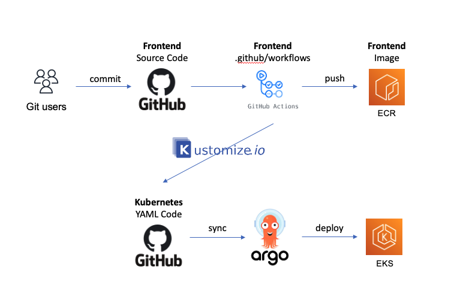
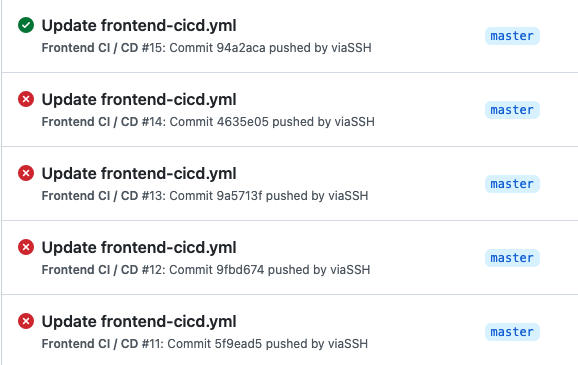
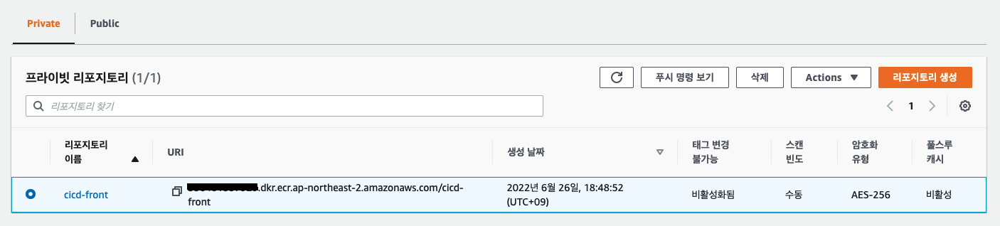
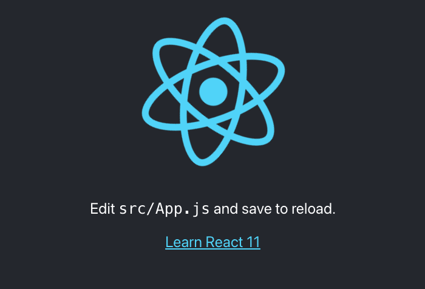

기존 배포방식

Source Code -> Github -> Github Action -> Code Pipeline (Code Deploy) - blue/green -> EC2

EKS 도입 후 배포 방식 변화

Source Code -> Github -> Github Action -> ECR -> Kustomization (gitops New Repository) -> Argocd -> EKS




### 사전 지식

**Github Action 이란**

CI/CD Woroflow를 자동화 할 수 있는 도구. Github repository에 push, merge와 같은 특정 이벤트가 발생했을 경우에 yaml 파일에 따른 빌드, 배포를 순차적으로 수행하게 만드는 도구.
> 일반적으로는 feature 브랜치, develop 브랜치에서 master 브랜치로 PR을 날려 master에서 리뷰 후 merge를 하면 수동 혹은 자동적으로 Github Action Workflow가 돌아가도록 설계를 한다. 이번 포스팅에서는 간단히 master에 바로 push가 되면 자동적으로 workflow가 돌아가도록 세팅을 할 것이다.


지금은 frontend 소스에 뭐 별게 없어 1분정도만에 빌드가 끝나는데 규모가 커지면서 빌드 시간도 오래걸려지고 저렇게 빨간색 fail이 계속뜨면 마음이 아프다. 그래서 일단 소규모로 파이프라인을 잡아두고 소스단은 나중에 붙이면서 틀을 잡아가는걸 선호한다.

=> Docker buildx 를 추가하고 `docker/build-push-action` 헐때 cache-from, cache-to를 사용해 빌드 캐쉬를 사용할 수 있다!

=> 사용 전 2분18초 -> 사용 후 1분25초

**Github Action Workflow YAML 파일 구조**

1. on - workflow 를 실행시킬 조건. push 대신 merge 등을 사용할 수 있다.
   ``` yaml
    # 자동 실행
    on:
      push:
        branches:
          - "master"

    # 수동 실행      
    on:
      workflow_dispatch:
        inputs:
          logLevel:
            description: 'Log level'
            required: true
            default: 'warning'

    # 매주 월요일~금요일 KST+9 낮 12시에 실행 (UTC 03:00)
    on:
      schedule:
        - cron: '0 3 * * 1-5' 
   ```
2. jobs - workflow 는 여러개의 job으로 구성될 수 있음. 
   
   job이 여러개면 병렬적으로 실행됨.
   
   각 step은 순차적으로 실행됨. 

   ``` yaml
   jobs:
    deploy:
      name: Deploy
      runs-on: ubuntu-latest # 어떤 os 에서 실행시킬지
      environment: production

      steps:
      # Github에 저장된 코드를 CI 서버로 내려받아 뒷 step에서 사용할 수 있도록 하는 과정
      - name: Checkout
        uses: actions/checkout@v3
   ```

**ECR 이란**

Docker Container 이미지를 저장, 관리 및 배포할 수 있게 해주는 Docker Container Registry 이다. 

Public, Private 리포지토리가 있고 퍼블릭의 URI는 **public.ecr.aws/1q2w3e4r/my-public-repo** 의 형태이고 프라이빗 URI는 **123412341234.dkr.ecr.ap-northeast-2.amazonaws.com/my-private-repo** 와 같다.

eksctl로 cluster와 nodegroup을 별도의 파라미터 없이 생성하게되면 nodegroup에 `AmazonEKSWorkerNodePolicy , AmazonEC2ContainerRegistryReadOnly , AmazonSSMManagedInstanceCore` 의 정책이 붙게된다. 여기에서 `AmazonEC2ContainerRegistryReadOnly` 이 정책을 보면 
```json
{
    "Version": "2012-10-17",
    "Statement": [
        {
            "Effect": "Allow",
            "Action": [
                "ecr:GetAuthorizationToken",
                "ecr:BatchCheckLayerAvailability",
                "ecr:GetDownloadUrlForLayer",
                "ecr:GetRepositoryPolicy",
                "ecr:DescribeRepositories",
                "ecr:ListImages",
                "ecr:DescribeImages",
                "ecr:BatchGetImage",
                "ecr:GetLifecyclePolicy",
                "ecr:GetLifecyclePolicyPreview",
                "ecr:ListTagsForResource",
                "ecr:DescribeImageScanFindings"
            ],
            "Resource": "*"
        }
    ]
}
```
이와 같은 형태로 nodegroup에서 ecr에 접근하여 get, list 를 할 수 있는 모든 권한이 생기게 된다. 나중에 세부적인 권한을 관리하기 위해서는 Resource 부분에 특정 리포지토리만 접근을 주면 된다. 

나중에 k8s deploymeny에 image 에 ecr private 레포 URI를 입력해줬는데 어떻게 얘가 접근을 하고있는거지? 라고 의문이 든다면 해당 node group 에 위와같은 정책이 붙어있어서 ecr private에 접근해 이미지를 가져오고 있는 것이라고 생각하면 된다.

`aws ecr get-login-password --region ap-northeast-2 | docker login --username AWS --password-stdin 000000000000.dkr.ecr.ap-northeast-2.amazonaws.com` 이런 CLI push 명령어는 CI/CD 자동화로 구성을 할 것 이기에 안 볼 것이다. workflow YAML 파일 중 **aws-actions/amazon-ecr-login** 에서 내부적으로 저 aws sdk 명령어를 사용해 편하게 ecr을 사용할 수 있는 것이다. [https://github.com/aws-actions/amazon-ecr-login/blob/main/index.js] 그냥 궁금해서 찾아봄


**Kustomize 란**

쿠버네티스의 YAML 파일을 보다 쉽게 관리할 수 있도록 도와주는 툴

템플릿이 없는 방식으로 구성파일의 커스터마이징을 쉽게할 수 있다고 하지만 쉽게 와닿지는 않았다. 전체적으로는 좀더 공부가 필요한 부분이지만 이번에는 간단하게 필요한 부분만 알아보고 썼다.

쉽게 보자면 프런트 소스를 빌드하고 ECR에 배포했는데 이때 바뀐 이미지를 EKS에 배포해야하지 않는가. 

1. 이를 **누가** **어떻게** 알아챌 것인가? -> 이를 **Argo**가 **특정 Github Repo**를 바라보고있다.
2. 프런트 repo의 Github Action이 빌드한 이미지의 특정 값을 다른 repo의 kutomize.yaml 안에 이미지 태그 값을 변경한다,
3. Argo는 이 repo의 kustomize.yaml를 바라보고있으며 resource 안에 있는 deployment.yaml 파일의 image tag 값을 자동으로 바꿔 배포해준다.


### 시작하기

사전조건. EKS에 Argocd 가 설치되어있어야함.

1. Front 코드 준비 (React 사용)
   - `npx create-react-app front-sample-eks`  - 샘플 앱 생성
   
2. Dockerfile 생성
   
``` docker
  FROM node:14.15.4 as builder

  # 소스 폴더 생성
  RUN mkdir /usr/src/app
  WORKDIR /usr/src/app
  ENV PATH /usr/src/app/node_modules/.bin:$PATH
  COPY package.json /usr/src/app/package.json

  # 패키지 설치
  RUN npm install --silent
  # RUN npm install react-scripts@3.4.1 -g --silent

  # 작업폴더로 복사하고 빌드
  COPY . /usr/src/app
  RUN npm run build

  FROM nginx:1.19

  # nginx의 기본 설정을 삭제하고 앱 소스에서 설정한 파일을 복사
  # 소스 코드에 /conf/conf.d 파일이 있어야함
  RUN rm -rf /etc/nginx/conf.d
  COPY conf /etc/nginx

  # 생성한 앱의 빌드산출물을 nginx의 샘플 앱이 사용하던 폴더로 이동
  COPY --from=builder /usr/src/app/build /usr/share/nginx/html

  # 80포트 노출 후 nginx 실행
  EXPOSE 80
  CMD ["nginx", "-g", "daemon off;"]
```
3. ECR 생성
   - 프라이빗 리포지토리 생성


4. Github Action 설정
   - 최상위 경로에 `.github/workflows` 에 yaml 파일 생성
     - `frontend-cicd.yaml`
```yaml
name: Frontend CI / CD

# master 브랜치에 push 되면 workflow 작동
on:
  push:
    branches:
      - "master"

# 수동으로 workflow 실행 실행시킬때
# on:
#   workflow_dispatch:
#     inputs:
#       logLevel:
#         description: 'Log level'
#         required: true
#         default: 'warning'

# workflow 내에서 사용할 변수 값 저장
env:
  AWS_REGION: ap-northeast-2                   
  ECR_REPOSITORY: "cicd-front"           
  
# permissions:
#   contents: read

jobs:
  deploy:
    name: Deploy
    runs-on: ubuntu-latest # 어떤 os 에서 실행시킬지
    environment: production

    steps:
    # Github에 저장된 코드를 CI 서버로 내려받아 뒷 step에서 사용할 수 있도록 하는 과정
    - name: Checkout
      uses: actions/checkout@v3 

    # Github Secret과 local env 에 저장된 값 불러오기
    - name: Configure AWS credentials
      uses: aws-actions/configure-aws-credentials@v1
      with:
        aws-access-key-id: ${{ secrets.AWS_ACCESS_KEY_ID }}
        aws-secret-access-key: ${{ secrets.AWS_SECRET_ACCESS_KEY }}
        aws-region: ${{ env.AWS_REGION }}

    # access key와 secret를 사용하여 ECR에 push할 수 있도록 인증
    - name: Login to Amazon ECR
      id: login-ecr
      uses: aws-actions/amazon-ecr-login@v1
    # Github action console에서는 아래와 같이 ***로 암호화돼서 보이게된다. 잘못들어간 값이 아님.  
    # AWS_ACCESS_KEY_ID: ***
    # AWS_SECRET_ACCESS_KEY: ***
    # ***.dkr.ecr.ap-northeast-2.amazonaws.com 의 ***도 마찬가지

    # Dockerfile 을 기준으로 이미지 빌드 후 ecr로 push
    - name: Docker Build and ECR Push
      id: docker_build
      uses: docker/build-push-action@v2
      with:
        context: .
        file: ./Dockerfile
        platforms: linux/amd64
        push: true
        tags: ${{ steps.login-ecr.outputs.registry }}/${{ env.ECR_REPOSITORY }}:${{ github.sha }}
      # 내부적 로직은 아래와 같음
      # docker build -t cicd-front .
      # docker tag cicd-front:latest 123412341234.dkr.ecr.ap-northeast-2.amazonaws.com/cicd-front:latest
      # docker push 123412341234.dkr.ecr.ap-northeast-2.amazonaws.com/cicd-front:latest

    - name: Checkout for Kustomize repository
      uses: actions/checkout@v2
      with:
        # kubernetes yaml 파일 저장
        repository: viaSSH/cicd-gitops-eks # k8s yaml 파일이 있는 repo
        ref: frontend  # branch 이름
        # 내 repository에 push 하기 위한 Personal Access Token이 필요
        token: ${{ secrets.ACTION_TOKEN }} # Github Action token을 발급받아서 repo secrect에 등록해줘야한다
        path: cicd-gitops-eks # 최상위 경로로 repository와 동일하게 설정

    # 새 이미지 버전으로 파일의 태그값 수정
    # cd path 수정
    # kustomize 로 image tag 값 변경
    - name: Update Kubernetes resources
      run: |
        pwd
        cd cicd-gitops-eks/overlays/prd/ 
        echo \${{ steps.login-ecr.outputs.registry }}/\${{ env.ECR_REPOSITORY }}
        echo \${{ steps.login-ecr.outputs.registry }}/\${{ env.ECR_REPOSITORY }}:\${{ github.sha }}
        kustomize edit set image \${{ steps.login-ecr.outputs.registry }}/\${{ env.ECR_REPOSITORY }}=\${{ steps.login-ecr.outputs.registry }}/\${{ env.ECR_REPOSITORY }}:\${{ github.sha }}
        cat kustomization.yaml

    # 수정된 kustomization.yaml 파일 commit push
    - name: Commit minifest files
      run: |
        cd cicd-gitops-eks
        git config --global user.email "hanseung0609@github.com"
        git config --global user.name "viassh"
        git commit -am "Update image tag ${{ github.sha }}"
        git push -u origin frontend


```


5. Argocd에서 읽어갈 Github repo 생성
   - kustomize 파일 세팅
     - 네임스페이스 생성. `kubectl create ns cicd`
   - Github Access tokens 발급받기
6. ArgoCD에서 5번 항목의 Github 세팅
   - Argo에서 repo 연결. Connect repo using https
 


7. 배포 테스트

```shell
viaSSH: ~/Documents/GitHub/EKS k get svc -n cicd
NAME                     TYPE           CLUSTER-IP      EXTERNAL-IP                                                                   PORT(S)        AGE
loadbalancer-service-1   LoadBalancer   172.20.37.222   abcdefghijkl147fe8eafb907045adca-111111111.ap-northeast-2.elb.amazonaws.com   80:31618/TCP   30h
```

k8s 서비스를 LoadBalancer로 설정하여 해당 url로 들어가면 이 화면을 볼 수 있다.

프런트 소스에서 숫자를 바꿔 github에 push만 하고 argo에서 sync만 눌러주면 자동으로 배포가 된다. 




프런트 소스 샘플 [https://github.com/viaSSH/front-sample-eks]

K8s 소스 샘플 [https://github.com/viaSSH/cicd-gitops-eks/tree/frontend]


### 에러핸들링

`Error: buildx failed with: error: EOF`

- docker/build-push-action@v2 사용 중 에러 발생

- 이게 무슨 에러인지 몰라 변수 이것저것 다 바꿔보고 삽질을 했지만 결국엔 ecr repo가 없어 image push를 못한것.. 아니 ecr에 레포 만들었는데 왜 에러가 떳지? 

ecr을 많이 안써봐서 당연히 public으로 만들었지만 
123412341234.dkr.ecr.ap-northeast-2.amazonaws.com/cicd-front
는 private ecr 이다...
=> ECR에서 Private repo를 만들어서 재 실행 하니 성공.. public repo로 `build-push-action` 하는 방법은 없던것인가?..