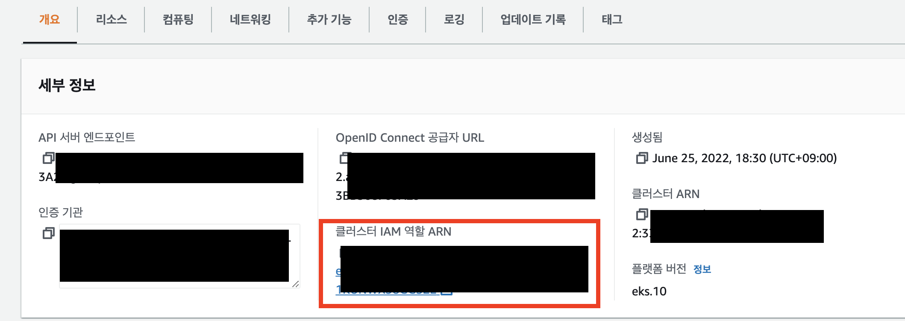
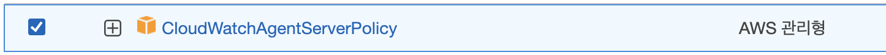

## EKS Container Insights 메트릭이 안보일때

> 클러스터 모니터링을 위해 EKS에 Cloudwatch의 Container Insights를 연동해보려고 한다. 
> https://docs.aws.amazon.com/ko_kr/AmazonCloudWatch/latest/monitoring/Container-Insights-setup-metrics.html 공식문서에 나온대로 cluster role, role binding, service account, config map, daemon set 을 다 설치하였으나 Cloudwatch에 메트릭이 뜨지 않았다. 이를 해결해보자.

## 에러문구

`k logs cloudwatch-agent-5hfjq  -n amazon-cloudwatch` 명령어를 통해 에이전트 파드의 로그를 찍어보자. `cloudwatch-agent-5hfjq` 는 `k get po -n amazon-cloudwatch` 로 확인해야한다. 노드 당 하나가 뜰거다.

에러는 다음과 같다. 10번의 재시도를 하는거같은데 1분, 3분, 10분 단위로 전형적인 `Exponential Backoff
` 지수 백오프 방식으로 재시도를 시도했다.

```
2022-09-07T08:48:09Z I! [processors.ec2tagger] ec2tagger: 9 retry for initial retrieval of tags and volumes
2022-09-07T08:48:09Z W! [processors.ec2tagger] ec2tagger: Unable to describe ec2 tags for initial retrieval: UnauthorizedOperation: You are not authorized to perform this operation.
	status code: 403, request id: d458fe0d-8526-4a09-b13f-4a617142f246
```

로그 내용을 봐보자면 `UnauthorizedOperation` 가 보일것이다. EKS on ec2로 해당 클러스터에 있는 인스턴스에서 Cloudwatch 로 로그를 전송을 못하고 있다는 말이다.

## 해결방법

EKS 클러스터 > 노드 그룹 선택 > 노드 탭 > 노드 IAM 역할 ARN 클릭 > 권한 추가 > **"CloudWatchAgentServerPolicy" 추가**




권한을 추가하고 cloudwatch-agent-***** 파드들을 삭제하여 재기동 시킨다. 생성 후에 Cloudwatch에 로그가 담기기까지는 약 10분이 걸린다.
