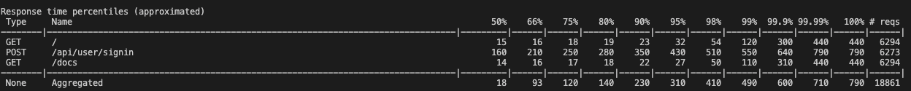
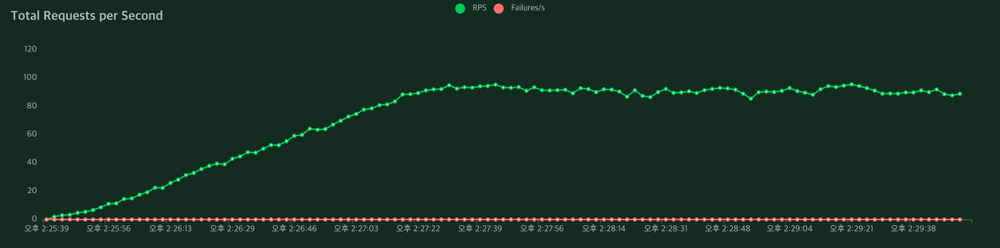
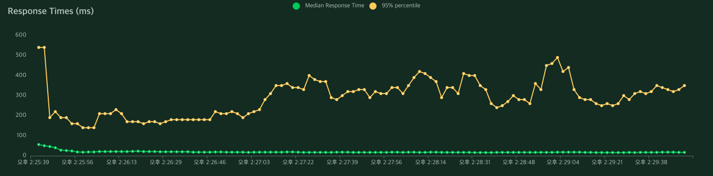
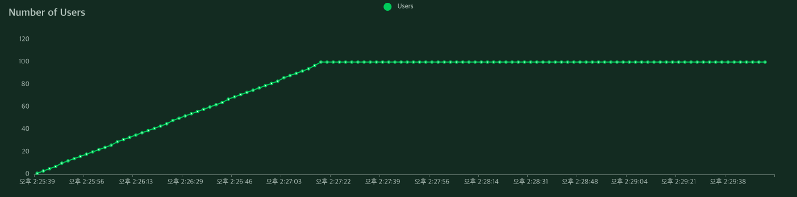
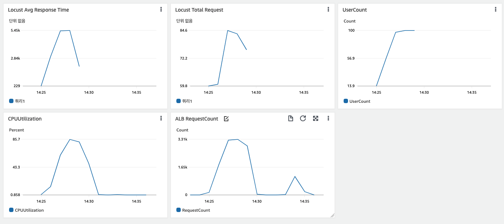
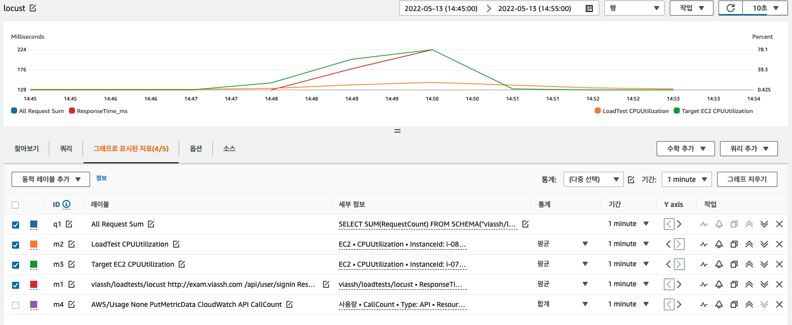

# Locust / CloudWatch Connector

Locust 부하테스트에서의 지표와 AWS 서비스들의 지표를 동시에 확인하고싶어 여러가지를 검색해보다가 딱히 마땅한 솔루션이 없어 python과 AWS SDK를 사용하여 CW로 로그를 전송하는 간단한 코드를 개발해보았습니다. 아래는 https://github.com/viaSSH/Locust_to_Cloudwatch 깃헙의 README 파일을 다시 적어놨습니다. 코드는 깃헙에서 확인가능합니다.

# Locust 부하테스트기

https://github.com/concurrencylabs/locust-cloudwatch 기존 레포에서 사용하던 Locust API 가 Deprecated 된 것이 많아 최근 API형식으로 변경하고 메트릭 지표와 실시간으로 CloudWatch에 로그를 보낼 수 있도록 변경한 것 입니다.

Locust에서 AWS EC2에 부하를 보낼때 EC2의 CPU사용량, Network IO과 Locust의 지표인 RPS(Requests per Second), Response Times, Number of Users 를 CloudWatch에서 바로 비교하면서 서비스를 분석할때 사용할 수 있습니다.


# Get Started

1. Locust를 설치 할 EC2에서 CloudWatch로 데이터를 삽입(put_metric_data, put_log_events)할 수 있도록 EC2 프로파일 설정.
    - IAM 역할 생성
2. Locust 설치

``` bash
pip3 install locust
pip3 install boto3
```
3. Locust 커넥터 파일 추가
    - locust_cw.py
    - locust_cw.py 에서 커스텀 값 변경. AWS_REGION, IAM_ROLE_ARN, CW Metric name 등

``` bash
AWS_REGION = "ap-northeast-2" # <us-east-1>
IAM_ROLE_ARN = "arn:aws:iam::987654321012:role/ec2AndCloudwatchFull"
```
4. Locust 테스트 파일 추가
    - 현재 레포 기준 test.py

5. 실행
    - `python3 locust_cw.py --host=https://google.com -f test.py`
    - `python3 locust_cw.py --host=https://google.com -f test.py --live=True ` # 실시간 로그 전송 활성화 
    - --host에 target 주소를 입력하여 테스트 진행

> - --live=True 옵션을 주면 Request 시 실시간으로 메트릭을 전송하게된다. Queue에 담긴 데이터가 일정갯수와 시간을 만족하면 전송하게된다.
> - live 옵션을 주지않으면 테스트가 종료되고 ctrl-c 를 눌러 locust를 빠져나가게되면 그동안 큐에 쌓인 데이터를 CloudWatch로 전송하게 된다.

6. 결과 저장
    - live 옵션을 주지않고 Locust 부하전송 완료 후 CloudWatch로 메트릭을 전송을 하려면 Locust 가 실행중인 터미널에서 Ctrl+C 로 실행 중인 테스트를 종료하면 큐에 남아있는 데이터를 전송하게 된다.
        - `ex) Start CW Loop. left Queue :  13446  left time :  268.92 s`
    - live옵션을 주어 실시간으로 CloudWatch로 전송을 했지만 Queue에 남아있는 메트릭이 있을 수 있으니 Ctrl+C로 메트릭과 로그를 전송할 수 있다.

# locust_cw.py 모듈이란
Locust의 이벤트 훅을 이용하여 Test의 시작과 끝, Request 요청이 발생할때 AWS CloudWatch API를 사용하여 메트릭을 전송하는 모듈입니다


# CloudWatch 설정 가이드
1. Locust에서 발생한 각 url 마다 생긴 메트릭지표를 CloudWatch에서 통합으로 보는 방법
    - CloudWatch의 쿼리를 사용하여 각 메트릭을 통합하여 사용
    - `SELECT SUM(RequestCount) FROM SCHEMA("viassh/loadtests/locust", Host,Request)` 다음과 같이 설정하여 모든 Request를 통합할 수 있다.
    - 단, Cloudwatch에서는 1개의 쿼리밖에 지원하지 않고있다...
    - CloudWatch 의 Query는 최대 3시간만 검색할 수 있다.
2. Number of Users 인 `UserCount` 지표를 추가하여 현재의 유저 수를 보여준다.
3. Target 인스턴스의 CPU Utilization을 추가하여 확인한다.
    - Auto Scaling을 사용할 경우 연동하여 해당 ASG의 메트릭을 확인한다.
    - ALB메트릭이나 RDS 메트릭을 추가하여 확인한다.

# 테스트 결과

Locust 테스트를 완료하면 다음과 같은 수치를 확인할 수 있다.


Locust의 Web UI에서는 다음과 같이 Response Time, Total Request, User Number를 확인할 수 있다.




CloudWatch에 보낸 메트릭을 EC2 메트릭과 ALB메트릭을 Cloudwatch 대쉬보드에 통합하여 확인할 수 있다.






# 유의사항
- Locust의 webui는 기본으로 8089포트를 사용하므로 EC2의 보안그룹에서 해당 포트를 열어놔야한다.


# 비용 

서울리전 기준
|API|Price|
|---|---|
|GetMetricData, GetInsightRuleReport | 요청된 지표 1,000개당 0.01 USD|
|GetMetricWidgetImage|요청된 지표 1,000개당 0.02 USD|
|GetMetricStatistics, ListMetrics, <span style="color:lightgreen">**PutMetricData** </span>, GetDashboard, ListDashboards, PutDashboard 및 DeleteDashboards 요청|요청 1,000개당 0.01 USD|
