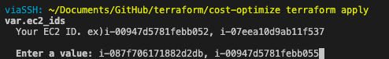
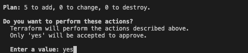
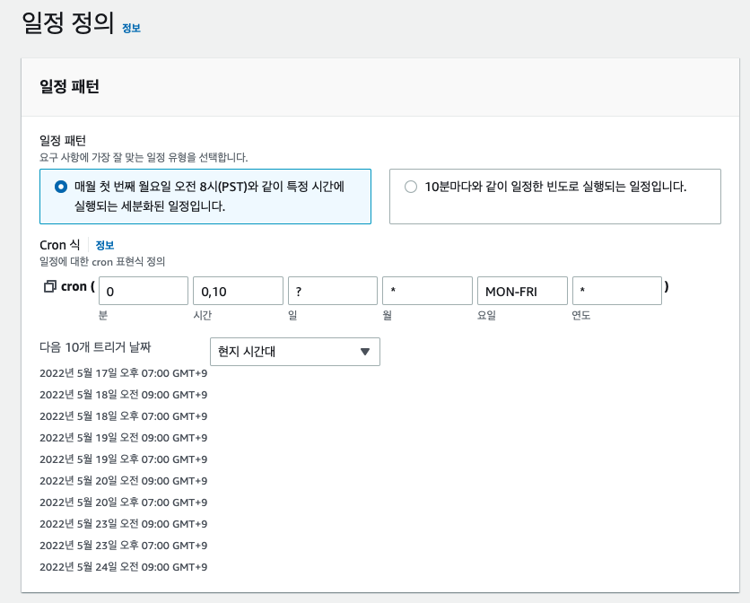

## EC2 자동 시작 정지 구현하기 (with Terraform)

### EventBridge + Lambda 를 사용한 자동화

> 특정 시간에 EC2 인스턴스를 자동으로 끄고 키는 서비스를 간단하게 구현

EventBridge의 규칙에는 EC2 RebootInstances, StopInstances, TerminateInstances API를 호출할 수 있는 기능은 있지만 Start 하는 기능은 없습니다. 이를 따로 Lambda에서 구현하여 사용하지 않는 시간대인 밤 시간대에는 자동으로 꺼지게 하고 아침에는 자동으로 켜지게 하여 인스턴스 비용을 줄일 수 있는 방법을 테라폼으로 간단하게 구현할 수 있습니다.

> 테라폼을 실행하면 EventBridge와 Lambda가 생성되며 인스턴스의 ID를 입력받아 특정 시간마다 인스턴스를 끄고 키게됩니다.

### 테라폼을 사용한 EC2 자동화 설정방법

[Github 코드 주소](https://github.com/viaSSH/EC2-Save-bot)

1. 테라폼 설치
2. 테라폼을 실행할 AWS 프로파일을 가져와야한다.
   - `
   provider "aws" {
    region  = "ap-northeast-2"
    profile = "YOUR_PROFILE" # 여기를 변경
    }`
    - profile을 변경
3. terraform init
4. terraform apply
5. apply를 하면 input에 자동화 할 EC2의 id 를 컴마로 구분하여 입력한다.
   - EX) i-087f706171882d2db, i-00947d5781febb055

- 자동 시작은 한국시간 기준 오전 9:00, 자동 종료는 19:00에 꺼지게된다.

### EC2 아이디 입력

### 입력 완료 후 yes 입력

### CRON 예시

### 기대효과
24시간 돌고있는 인스턴스를 위 크론과 같이 미사용 시간에 끄게되면 58%의 비용을 아낄 수 있다.
- 19:00 ~ 익일 09:00 OFF 기준
