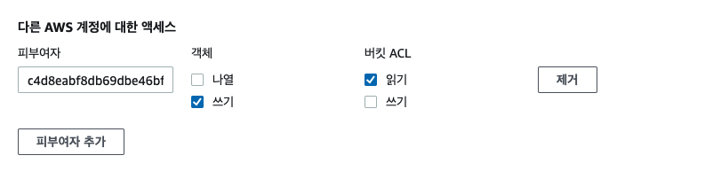
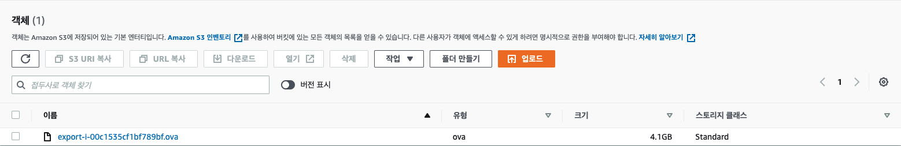

VM Export 를 사용해서 이미지 내보내기
=============

EC2 VM Import, Export 는 콘솔에서는 작업이 안되며 **AWS CLI**를 사용해서 이미지를 만들어야한다.

EC2에서 사용하고 있는 모든 이미지를 지원하는 것이 아닌 일부의 AMI에서만 VM Export 기능을 사용할 수 있으니 확인해야 한다.

외부에서 터미널 연결을 하고있다면 잠시 끊기게된다.

## 인스턴스 VM 내보내기 하는 방법

1. 옮기고자 하는 인스턴스의 ID를 확인
2. **옮길 S3의 버킷 정책 수정** 
   - 설정하지 않고 넘어가면 버킷에 아무리 퍼블릭 엑세스를 주더라도 접근이 안되어 에러가 발생한다.
   - 아래 에러해결 부분에 설명한 버킷 ACL 설정을 진행하여야한다.
3. aws cli 를 실행할 위치에 config.json 파일을 생성하여 Container foramt과 내보낼 S3 버킷 위치 지정
   - ```json 
        {
        "ContainerFormat": "ova",
        "DiskImageFormat": "VMDK",
        "S3Bucket": "my-ec2-export-s3-bucket",
        "S3Prefix": "vms/"
        } 
        ```
   - DiskImageFormat 은  "VMDK", "RAW", "VHD" 중 선택 가능
   - VMDK (Virtual Machine Disk)의 약자로 가상머신에서 사용하는 가상 머신 디스크이다.
   - VHD (Virtual Hard Disk)로 가상 하드 디스크이다. 
   - VMWare에서는 주로 VMDK 형식이 일반적이라 VMDK로 선택하여 진행한다.

4. aws cli가 가능한 위치에서 아래 명령어 입력
`aws ec2 create-instance-export-task --instance-id i-00947d57800000000 --target-environment vmware --export-to-s3-task file://config.json`
    - ec2 관련 권한이 없다면 실행 가능한 프로파일로 변경하여 진행
    - ex) `aws ec2 create-instance-export-task --instance-id i-00947d57800000000 --target-environment vmware --export-to-s3-task file://config.json --profile admin --region ap-northeast-2`


## 에러 해결

첫번째 에러
> `An error occurred (NotExportable) when calling the CreateInstanceExportTask operation: This instance has multiple volumes attached. Please remove additional volumes.`

인스턴스에 2개의 EBS가 붙어있어서 진행이 안되었다. df 명령어로 어떤 볼륨을 사용하지 않는지 확인해서 EBS 콘솔에 들어가 볼륨분리를 한 후 진행하여야 한다. 

공식문서에 인스턴스 내보내기를 위한 고려 사항으로 제약사항들이 설명되어있으므로 참고해야한다.


두번째 에러
> `READ_ACL and WRITE permissions are required on the destination bucket.`

에러가 나올 시 에는 옮길 S3 버킷의 ACL 설정이 빠진것 이다.

https://docs.aws.amazon.com/ko_kr/vm-import/latest/userguide/vmexport.html#vmexport-prerequisites 를 참고하여 ACL 편집에 들어가 Region에 맞는 ID값을 확인해 `다른 AWS 계정에 대한 엑세스` 에 계정을 추가해야한다. 

권한은 **객체 쓰기**, **버킷 ACL 읽기** 를 추가해줘야한다.



세번째 에러
>`Error parsing parameter '--export-to-s3-task': Expected: '=', received: 'EOF' for input:` 

export-to-s3-task 옵션에 입력이 잘못된 것이다. file:// 을 붙여주고 경로와 파일명을 지정해줘야한다.

`aws ec2 create-instance-export-task --instance-id i-00947d57800000000 --target-environment vmware --export-to-s3-task file://config.json`

## VM Export 완료 시 결과물

4G 용량의 ova 파일이 만들어지는데 약 40분정도가 걸린것 같다. 이제 다운받아 외부에서 자유롭게 import 하여 사용하면 된다.



참고 문서
aws ec2 create-instance-export-task 에 대한 명령어 상세 정보를 확인해야 될때는 https://docs.aws.amazon.com/cli/latest/reference/ec2/create-instance-export-task.html 에서 확인 가능하다.