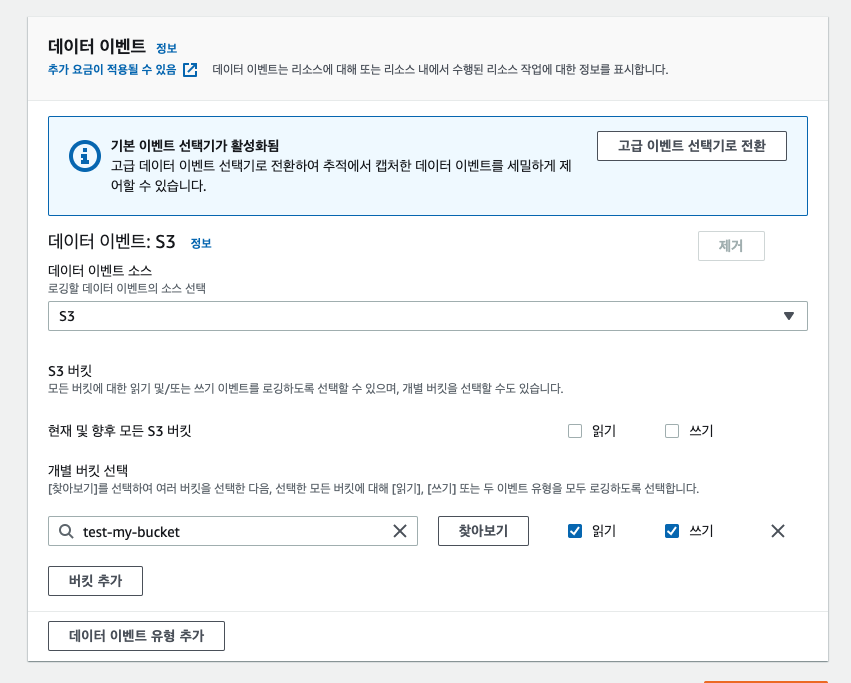

얼마전 아래와 같은 메일을 받았다. 그동안 Cloudtrail에서 S3 이벤트를 추적하기 위해 데이터 이벤트를 활성화하고 그 이벤트를 Cloudwatch logs나 S3로 보내 일일히 검색하는 번거로움이 있었는데 조만간 업데이트를 통해 기존처럼 `이벤트기록` 탭에서 보다 쉽게 확인 할 수 있겠다.

```
안녕하세요,

Amazon S3가 AWS CloudTrail 데이터 이벤트를 확장하여 버킷 소유자가 객체 수준 권한 또는 ACL에 관계없이 
모든 객체 수준 API 작업에 대한 데이터 이벤트를 수신할 수 있도록 할 것임을 알려드립니다.

대부분의 Amazon S3 API 작업에서 AWS CloudTrail은 요청자와 버킷 소유자 [1] 모두에게 객체 수준의 데이터 이벤트를 제공합니다. 
그러나 4개의 객체 수준 API (GetObject, GetObjectACL, PutObjectACL 및 헤드 오브젝트) 의 경우 
버킷 소유자 객체의 ACL (액세스 제어 목록) 을 통해 읽기 액세스 권한이 특별히 부여되지 않은 경우 CloudTrail 이벤트를 수신하지 않습니다.

2022년 11월 9일부터 객체 수준 권한 또는 ACL에 관계없이 모든 객체 수준 API 작업에 대한 데이터 이벤트를 버킷 소유자에게 전송하기 시작합니다. 
다음 주에 모든 요청에 대해 이 기능을 점진적으로 활성화할 예정입니다.

질문이나 우려 사항이 있는 경우 AWS Support [2] 에 문의하십시오.
[1] https://docs.aws.amazon.com/AmazonS3/latest/userguide/cloudtrail-logging-s3-info.html
[2] https://aws.amazon.com/support
```

## 기존 방식
> 기존에는 데이터 이벤트를 따로 활성화하지 않으면 S3 bucket 단위의 API 만 추적이 가능했다. 각 객체가 누구에 의해 호출되고 언제, 그리고 얼마나 자주 호출되는지는 알 길이 없었다. 별도로 백엔드에서 구축해놓지않은 이상.. 그래서 이를 확인하기 위해 `데이터이벤트` 를 활성화하여 버킷단위 별로 읽기, 쓰기에 대한 이벤트를 추적하고 기록할 수 있다. 


오브젝트 단위 이벤트는 없다.




위 처럼 S3 버킷의 데이터이벤트를 추적하기 위해 Cloudtrail 옵션을 활성화 해놓는다. 그러면 Cloudwatch logs 와 S3 에 로그가 저장된다! 

S3에 저장된 로그들은 S3 select로 확인해보거나 Athena로 별도로 쿼리날려서 확인해봐야하는데.. 쉽진 않다. 디버깅할때 로그파일을 다운받아서 cmd+f 로 특정 문자열을 찾아보는 편.. Athena를 잘 다루면 나중에 포스트를 올려봐야지.


## 다중 리전 추적 비활성화
> 내 서비스들은 모두 서울 리전에 있는데 us-east, ap-northeast-1 등 여러 리전들의 모든 로그들을 다 수집하는건 과하다고 생각한다. 그런데 CloudTrail의 추적을 생성한 후 다중 리전 추적을 비활성화 하려고하니 수정할 수 없었다. 이는 콘솔에서는 변경하지 못하고 cli로 변경해야한다.

* Cloudtrail의 multi region trail의 기본값은 활성화 이다.
* 해당 기능을 끄고싶으면 `aws cloudtrail update-trail --name my-trail --no-is-multi-region-trail` 를 입력하여 해당 trail을 변경할 수 있다.
* 다시 활성화 명령어 `aws cloudtrail update-trail --name my-trail --is-multi-region-trail`


* 결과값으로 `IsMultiRegionTrail` 의 값이 true, false로 바뀔것이다.


## 특정 S3 버킷의 이벤트를 추적해야할 상황 발생
> 이 버킷이 언제 얼마나 호출되고 어떤 API 가 쓰는지 확인을 해야했다.
> 위의 Cloudtrail에서 데이터 이벤트를 활성화하여 별도로 로깅하고 분석하는 방법도 있지만 S3에서 숨겨진? 기능이 있었다.


1. **버킷에 지표탭에 들어가 버킷지표의 하단에 `추가차트 보기`를 선택**
2. 요청 지표에 들어가 필터를 생성
3. 수분 뒤에 버킷에 생성된 지표 확인

여기서 확인할 수 있는 지표들은 총 16개이다.
1. 모든 요청 - 버킷에 대한 모든 HTTP 요청
2. 요청 가져오기 - GET 요청
3. PUT 요청
4. DELETE 요청
5. HEAD 요청
6. POST 요청
7. SELECT 요청
8. 스캔된 바이트
9. 반환된 바이트
10. LIST 요청
11. 다운로드된 바이트
12. 업로드된 바이트
13. 4xx 오류 갯수
14. 5xx 오류 갯수
15. 첫 번째 바이트 지연 시간 - 요청을 수신하는 시점부터 응답이 반환되기 시작하는 시점까지의 시간
16. 총 요청 지연 시간 - 첫번째 바이트를 수신한 시점부터 마지막 바이트를 수신한 시점까지의 경과시간


위 값들은 Cloudwatch에서도 확인할 수 있어서 Cloudwatch Event와 적절히 연동하면 필요한 모니터링 체계를 구축할 수 있을 것이다.