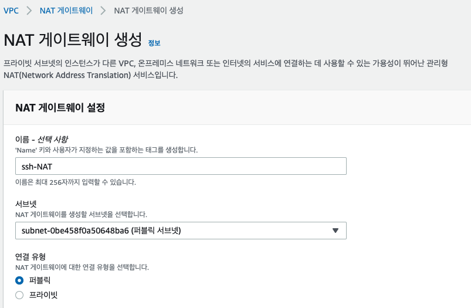

NAT Gateway 란
=============

> NAT게이트웨이는 프라이빗 서브넷에 있는 리소스들이 인터넷과 통신하기 위한 네트워크 주소 변환 관리형 서비스입니다.

- EC2에서 NAT역할을 하는 AMI를 가져와 실행하는 NAT 인스턴스 방식도 있지만 더 나은 가용성, 대역폭과 편리한 유지관리를 위해 NAT 게이트웨이를 사용하는 것이 권장된다.

# NAT Gateway 연결유형

### 퍼블릿 유형 vs 프라이빗 유형
- 퍼블릭
  - 일반적으로 프라이빗 서브넷에 있는 인스턴스가 외부 인터넷과 통신할 수 있도록 설정하는 역할
- 프라이빗
  - 프라이빗 NAT로 다른 VPC나 온프렘 네트워크에 연결할때 사용한다.