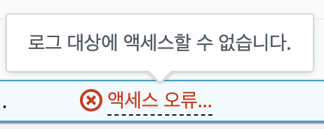

# VPC Flow log 란
VPC Flow 로깅을 활성화하면 VPC의 네트워크 트래픽에 대한 데이터를 캡처하고 기록할 수 있습니다. VPC Flow 로깅은 지정된 네트워크 인터페이스로 송수신되는 IP 데이터에 대한 정보를 기록하고 이 Raw 데이터를 CloudWatch나 S3에 저장하여 검색 및 볼 수 있습니다. VPC Flow 로깅은 AWS 클라우드 환경의 보안 및 규정 준수에 매우 중요합니다.

## 설정 시 오류 사항들
액세스 오류. 로그 대상에 액세스할 수 없습니다 (Access error. The log destination is not accessible.) 이라고 나오며 CloudWatch log에 저장이 안되는 경우

  - CloudWatch의 IAM Role 확인
  
  권한 정책에서 설정이 잘 되어있다면 `신뢰정책`이 문제
  CloudWatchFullAccess 정책을 부여한다면 정책문은 아래와 같습니다.
``` json 
    {"Version": "2012-10-17",
    "Statement": [
        {
            "Action": [
                "autoscaling:Describe*",
                "cloudwatch:*",
                "logs:*",
                "sns:*",
                "iam:GetPolicy",
                "iam:GetPolicyVersion",
                "iam:GetRole"
            ],
            "Effect": "Allow",
            "Resource": "*"
        }
        ]
    }
```
  하지만 신뢰관계는 role 생성 시 대부분 EC2 로 설정하여 만들기때문에 이를 변경하지 않았다면 액세스 오류가 나오게 됩니다. 
  나의 CloudWatch Log로 VPC 서비스가 API호출을 해야하기 때문에 VPC에서 호출할 수 있는 권한을 부여해야합니다.
  신뢰관계 탭에 들어가 **신뢰할 수 있는 엔티티**를 다음과 같이 변경합니다.

   `"Service": "ec2.amazonaws.com"` => `"Service": "vpc-flow-logs.amazonaws.com"`
``` json
    {
        "Version": "2012-10-17",
        "Statement": [
            {
                "Effect": "Allow",
                "Principal": {
                    "Service": "vpc-flow-logs.amazonaws.com"
                },
                "Action": "sts:AssumeRole"
            }
        ]
    }
```

- 여러개의 VPC flow log
  - 한 VPC에서 여러개의 VPC 플로우 로그를 만들 경우는 없겠지만 혹시나 해서 만들어 보았는데 역시나 최대 집계 간격당 1개씩만 만들 수 있었다.
  - 1분 간격으로 집계하는 로그 1개, 10분 간격으로 집계하는 로그 1개. 각 로그를 별도의 저장소에 저장할 수 있다. 


## Terraform 으로 구축하기

``` json
resource "aws_flow_log" "vpc_flow_log" {
  iam_role_arn    = aws_iam_role.cloudwatch_full_for_vpc.arn
  log_destination = aws_cloudwatch_log_group.vpc_flow_log_cw.arn
  traffic_type    = "ALL"
  vpc_id          = aws_vpc.YOUR_VPC.id
}

resource "aws_cloudwatch_log_group" "vpc_flow_log_cw" {
  name = "vpc-flow-log-cw"
}

resource "aws_iam_role" "cloudwatch_full_for_vpc" {
  name = "cloudwatch-full-for-vpc"

  assume_role_policy = <<EOF
{
  "Version": "2012-10-17",
  "Statement": [
    {
      "Sid": "",
      "Effect": "Allow",
      "Principal": {
        "Service": "vpc-flow-logs.amazonaws.com"
      },
      "Action": "sts:AssumeRole"
    }
  ]
}
EOF
}

resource "aws_iam_role_policy" "cloudwatch_full_policy_for_vpc" {
  name = "cloudwatch-full-policy-for-vpc"
  role = aws_iam_role.cloudwatch_full_for_vpc.id

  policy = <<EOF
{
  "Version": "2012-10-17",
  "Statement": [
    {
      "Action": [
        "logs:CreateLogGroup",
        "logs:CreateLogStream",
        "logs:PutLogEvents",
        "logs:DescribeLogGroups",
        "logs:DescribeLogStreams"
      ],
      "Effect": "Allow",
      "Resource": "*"
    }
  ]
}
EOF
}
```